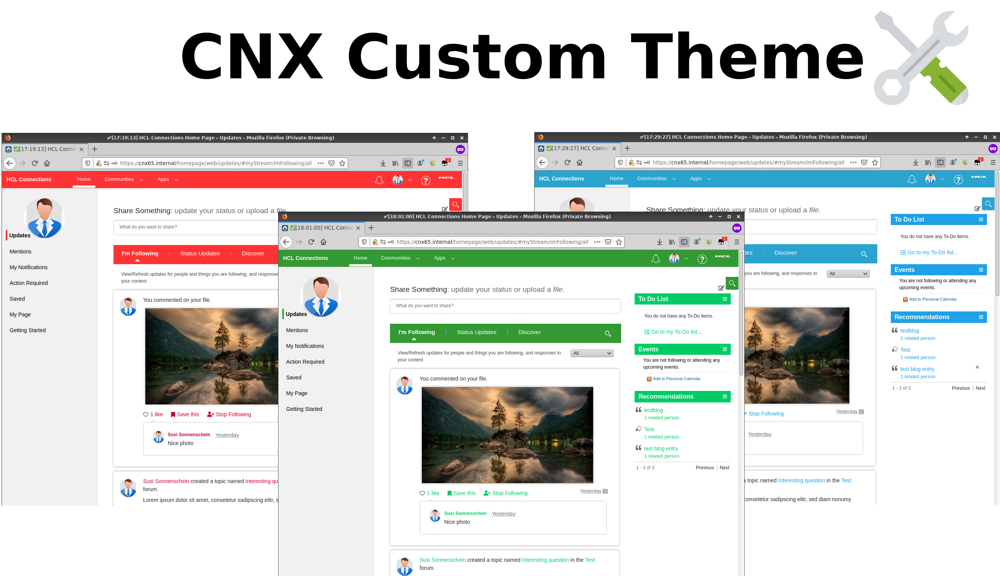
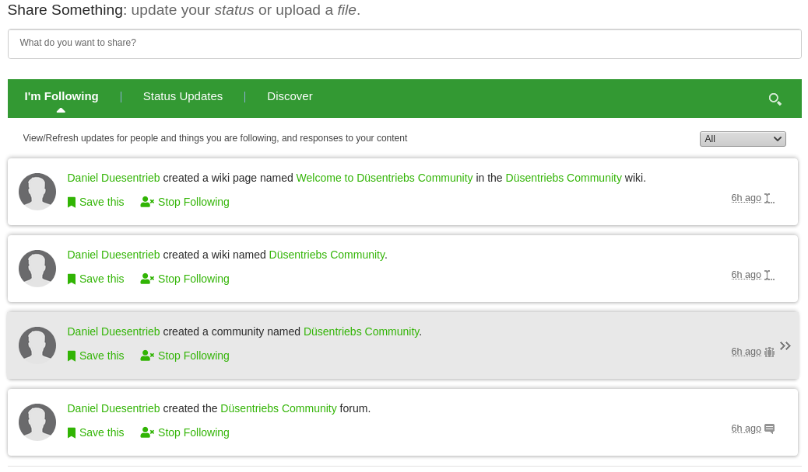
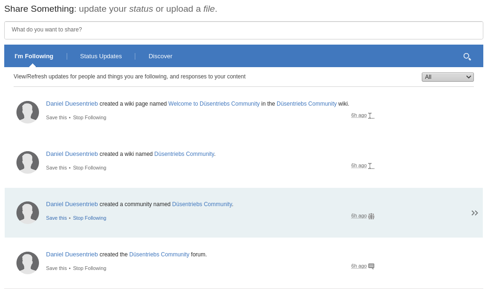
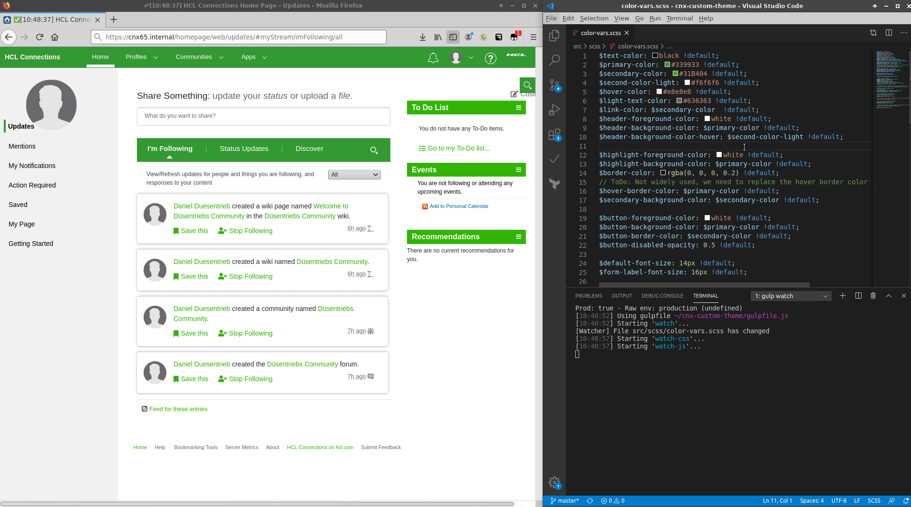

The CNX Custom Theme allows customizing Connections to your needs with as less work and headaches as possible. It was started in the end of 2018 to gave Connections a more modern look & feel and adjust them to our corporate design.  

## Main Features
- Set main colors for all Connections applications to fit them in your corporate style
- Activity Stream facelift: Added boxes around entries for a better distinction, FA icons for actions, use full width
- Added boxes around widgets in the right sidebar of the Activity Stream
- Many small improvements and bugfixes (e.g. increased font size for better readability)
- Up2date: Tested with 6.5 CR1 (Currently in use with 6.0 CR 6, too)
- Live Reloading: Instant see your changes in the browser for rapid development/testing

## Example of the activity stream
### With custom theme


### Connections default


## Getting started
### Requirements
The following guide is written for Ubuntu. Make sure you have a supported NodeJS Version (LTS, currently 12):

```bash
$ nodejs --version
v10.15.2
```

In this case, the version is outdated. Uninstall the packaged version, add the official NodeJS LTS Repo and install the latest stable LTS:

```bash
sudo apt remove nodejs
curl -sL https://deb.nodesource.com/setup_12.x | sudo -E bash -
sudo apt install nodejs
```
This should install the latest LTS release:

```bash
$ nodejs --version
v12.16.3
```

We also use `npx` to execute local installed packages:

```bash
npm i -g npx
```

Now, install the NPM dependencies from the project root:

```bash
npm install
```

It will take some time until all packages are installed. Make sure that NPM can download them. When running behind a (corporate) proxy, you must set `$http_proxy`, `$https_proxy` and maybe `$no_proxy`. For example, in your `~/.bashrc` file.

### Copy the example var files
The avaliable parameters can be controlled by a scss file called `color-vars.scss`. To apply modifications and protect them from being accidentially checked in to git, make a copy of the example file:

```bash
cp color-vars.example.scss color-vars.scss
```

Now you can modify `olor-vars.scss` to your needs. The file is excluded from git. I'd recomment to just override what you need at the end of the file. This is possible because all example values are declared as _default_, making them only apply when not already set before. 

Example:

```scss
// BEGIN custom modifications
$primary-color: red;
// ...
// END custom modifications
$text-color: black !default;

```
If you need help for choosing colors, try [a color picker](https://html-color-codes.info/webfarben_hexcodes/).

### Build CSS files
Execute the following gulp task using npx:

```bash
npx gulp scss
```

There is another task called `watch` designed for development: When you execute `npx gulp watch`, it will watch the file system for changes. When you modify and save a file, the css is automatically rebuild in the `dist` directory.

### Load customized files
To apply the changes, you need to move the files from the `dist` folder to your IHS webserver and load them in a customized `header.jsp` like this:

```html
<link
  id="custom-css"
  rel="stylesheet"
  type="text/css"
  href="/custom-theme/dist/css/custom-all.css?cache-control=max-age%3D0&lastModified=26052020"
/>
```

While [the official documentation](https://help.hcltechsw.com/connections/v6/admin/customize/t_customize_communities_new_theme.html) describes customizations on the default theme, I don't recommend this approach: It sometimes make customizations harder by having no control of the load order. When using external files like fonts or images, WAS rewrites those urls - this could cause problems, too. Per default, it requires a restart of the common applications to apply changes. This could be bypassed by enabling debug mode in WAS.

In fact, this makes customizations more complicated without providing real benefits. The customizer uses a better approach. This theme is currently not developed on top of the customizer because it has some bugs in the past. It's planned to re-try this with the latest version and port this theme on the customizer later.

## Automatically deploy css to IHS
If you would like to test in a production-ready way, I recomment uploading the css files to the IBM HTTP Server. So you can include them in `header.jsp`. To automate this, use the `sftp-watch-upload.sh` script. It requires `inotify`, which could be installed using apt on Ubuntu:

```bash
sudo apt install inotify-tools
```

Start the script in a terminal window (may adjust the server name, if not matching the default from this environment):

```bash
./sftp-watch-upload.sh
```

Now start gulps watch task in another terminal tab:

```bash
npx gulp watch
```
On every scss change, the following will happen:

1. Gulp detect the scss changes, compile them to css and update the css files in `bin/css`
2. Inotify detects the updated css file and copy them to IHS `htdocs` directory
3. After a page reload, you'll see the changes without restart

Disabling/purging cache may required, depending on your browser. But this is still much faster and easier than using CNX customization files, which requires a restart.

## Local live reloading
Allows you to see changes nearly immediately in your browser: You only need to save the file. The browser shows your changes locally just a few seconds later. This can improve development massively - especially when you have at least two screens. No manual work and no huge waiting times only to see a few css changes.



### Browser extension
1. Install [Tampermonkey](https://addons.mozilla.org/de/firefox/addon/tampermonkey/) if not already present as extension for your Browser
2. Click on the tampermonkey icon > _Create a new script_
3. Copy & paste the content of `src/tampermonkey/tampermonkey-extension.js` to the editor field
4. Adjust the `@match` directive to your connections base URL in the format `https://cnx65.internal/*`
5. Save all changes using CTRL + S.

### Server
Start the server:

```bash
$ node src/tampermonkey/tampermonkey-server.js
```

To rebuild the CSS on file changes, you need to run the watch task in another shell (e.g. terminal of your editor):

```bash
$ npx gulp watch
```

If you save any file, the following process happens:
1. The gulp task detect the changes
2. A rebuild of the dist file(s) is triggered
3. Tampermonkeys server reads the new combined css file and send them to the browser using websockets
4. The Browser replaces the `link` element with id `custom-css` if present. Otherwise, it would be append to the `head`.
5. You'll also see the timestamp of the last update in your Browsers title bar

## Credits
This project uses the power of other Open Source projects. Here I list the main of them:

- Icon from the head image of this readme created by [monkik](https://www.flaticon.com/de/kostenloses-icon/kundendienst_1086507) from [flaticon](https://www.flaticon.com/)
- [Font Awesome](https://fontawesome.com)
- [SASS](https://sass-lang.com/documentation)
- [NodeJS](https://nodejs.org)
- [Socket.io](https://socket.io/)
- [Gulp](https://gulpjs.com/)
- [Babel](https://babeljs.io/)
- [Browserify](http://browserify.org/)